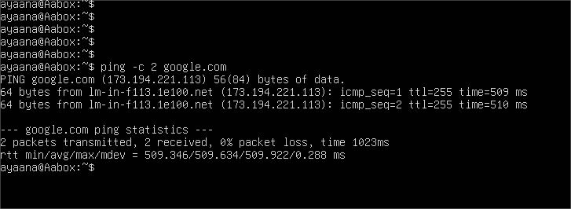
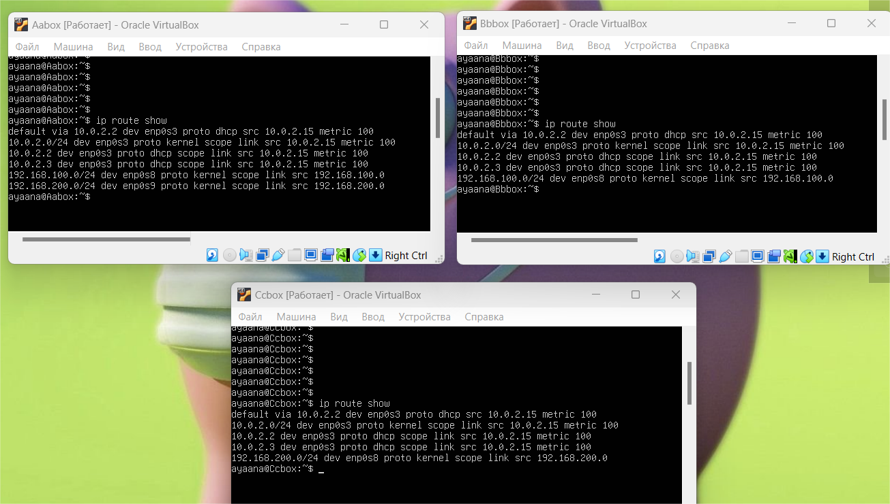
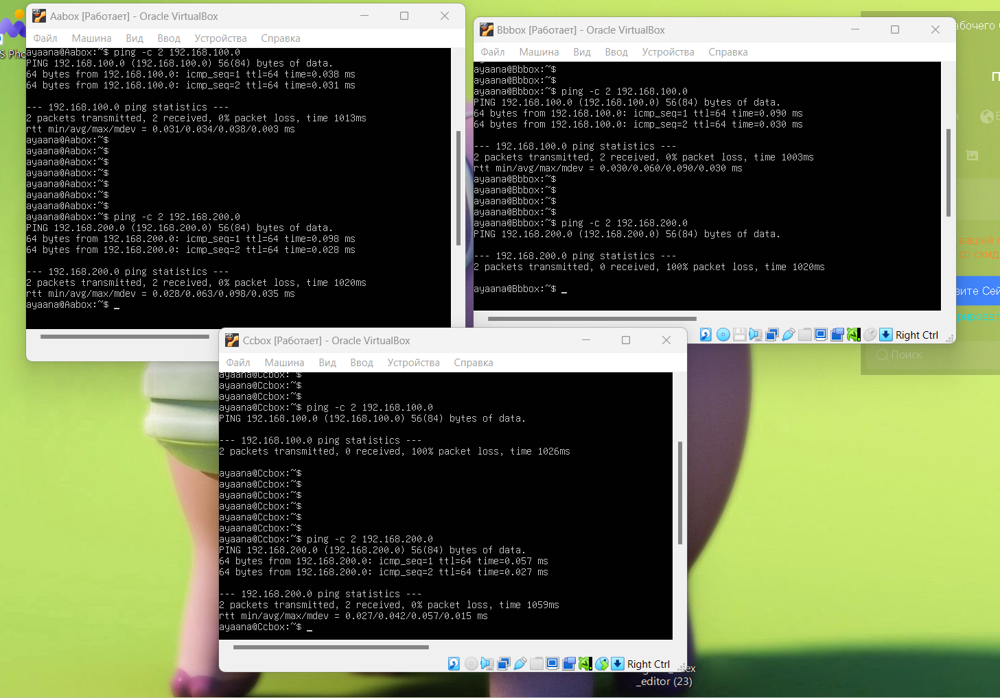

## Отчет к лабораторн работе №3
1) Переходим в менеджер сетей
2) Создаем сети NAT, AB - сеть между A и B, AC - сеть между A и C соответственно
3) Подключим сетевые адаптеры к машинам. Для этого необходимо для каждой машины перейти в Настройки -> Расширенные -> Сеть
4) Проверим подключение к интернету
```linux
ping -c 2 google.com
```


6) Проверим соединение между машинами
```linux
ip route show
ping -c 2 192.168.100.0
ping -c 2 192.168.200.0
```
Скриншот:





Видно, что B и C никак не связаны и не могут на прямую передавать друг другу пакеты.